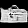
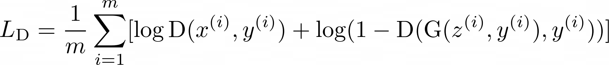
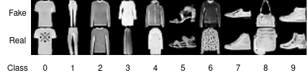

# Deepfashion Detector
Application that tells whether an image is a real or fake FashionMNIST data point. Fake images are generated with a GAN generator, for the classifier we use the GAN discriminator.

The goal of this project is to see how a trained discrimniator performs as a classifier of real/fake images.

## Prerequisites (tested on Linux)
- Python 3
- PyTorch
- Torchvision
- Tensorboard

## Model
The DCGAN architecture is used as the base model.
  - To make the GAN conditional I map the class label to an embedding space, which is then concatenated as an additional channel to the image.
  - For further training stabilization I used spectral normalization on all convolutions layers of the discriminator.

### Model training
To train the model with default options run `python train.py`. Please check `options.py` for user options.

### Trained model weights

The weights of a pretrained model can be downloaded [here](https://drive.google.com/drive/folders/16Qi0mQDVYo2tEl5ihA4qp868G8K3DIyQ?usp=sharing). After downloading, please make sure that the downloaded directory is placed in the working directory of the project.

The above model has been trained for 40 epochs

## Instructions for the fake fashion classifier
To classify an image run `python discriminator.py --im_path=<path to image> --im_label=<corresponding label>`

The above command assumes the that the discriminator is saved in the default path `checkpoints/base_model/final_trained_discriminator.pth`. The `--model_path` option allows to refer to the discriminator when it is saved on a different path.

**Input:**`python discriminator.py --im_path=images/0005_8.png --im_label=8`

**Output:** `{"label": "fake", "confidence": 0.53}`

## Loss function
The discriminator minimizes the following equation:

Whereas the generator maximizes the following equation:

with z as noise vector, y as class label and x as real data sample from the dataset

## Training loss curves and example images
Legend: 
  - generator loss (dark blue)
  - discriminator loss on fake images (light blue)
  - discriminator loss on real images (red)

We see that during early training the discriminator easily detects images generated by the generator. However, as the training progresses we see that both the discriminator and generator converge.

Example images fake vs. real:

## Accuracy of the discriminator as a classifier

We classify 2000 (fake/real) images with an accuracy of 72%. However, the accuracy fluctuates per testing batch with sometimes achieving an accuracy under 50% (worse than guessing). This means that the discriminator is not an accurate classifier for detecting fake images. This is confirmed when we output the mean and standard deviation of the softmax prediction, which is around 0.5 ± 0.02; these numbers inidicate that the discriminator is not confident of its prediction. 

The above observations also make sense from a theoretical standpoint, as a well trained generator synthesizes images that are hard to detect for the discriminator. If the discriminator would achieve a high classification accuracy it would be too powerful for the generator, hence, not allowing the generator to generalize on the task at hand.

In conclusion, spotting real from fake images is a hard task for the discriminator.

## Acknowledgments

As a starting point code from [1](https://github.com/TeeyoHuang/conditional-GAN/blob/master/conditional_DCGAN.py) and [2](https://pytorch.org/tutorials/beginner/dcgan_faces_tutorial.html#implementation) is used. Lastly, some architectural design choices are inspired from [3](https://machinelearningmastery.com/how-to-develop-a-conditional-generative-adversarial-network-from-scratch/).
