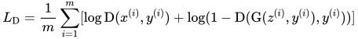
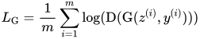
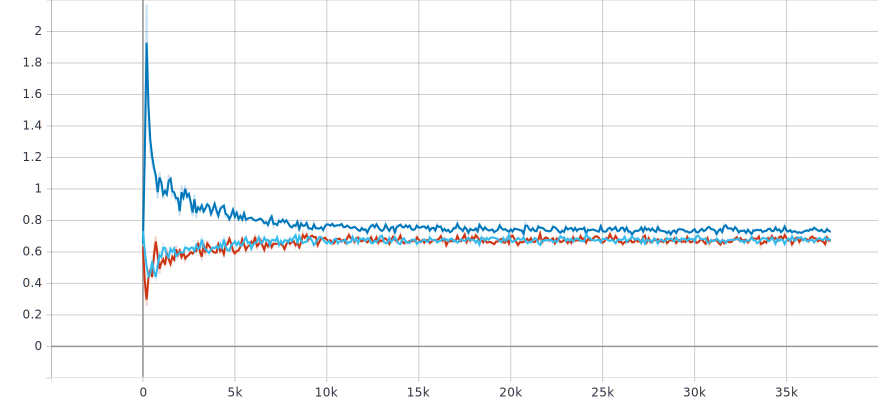

# Deepfashion Detector
Application that tells whether an image is a real or fake FashionMNIST data point. Fake images are generated with a GAN architecture.

## Prerequisites (tested on Linux)
- Python 3
- PyTorch
- Torchvision
- Tensorboard

See `environment.yml` for an exact copy of the used packages and versions.

## Model
The DCGAN architecture is used as the base model.
  - To make the GAN conditional I map the class label to an embedding space, which is then concatenated as an additional channel to the image.
  - For further training stabilization I used spectral normalization on all convolutions layers of the discriminator.

### Model training
To train the model with default options run `python train.py`. Please check `options.py` for user options.

### Trained model weights

The weights of a pretrained model can be downloadeded [here](https://drive.google.com/drive/folders/16Qi0mQDVYo2tEl5ihA4qp868G8K3DIyQ?usp=sharing). After downloading, please make sure that the downloaded directory is placed in the working directory of the project.

The above model has been trained for 40 epochs

## Questions

### Loss function
The discriminator minimizes the following equation:

Whereas the generator maximizes the following equation:

with z as noise vector, y as class label and x as real data sample

### Training loss curves
Legend: 
  - generator loss (dark blue)
  - discriminator loss on fake images (light blue)
  - discriminator loss on real images (red)

###

## Acknowledgments

As a starting point code from [1](https://github.com/TeeyoHuang/conditional-GAN/blob/master/conditional_DCGAN.py) and [2](https://pytorch.org/tutorials/beginner/dcgan_faces_tutorial.html#implementation) is used. Lastly, some architectural design choices are inspired from [3](https://machinelearningmastery.com/how-to-develop-a-conditional-generative-adversarial-network-from-scratch/).
